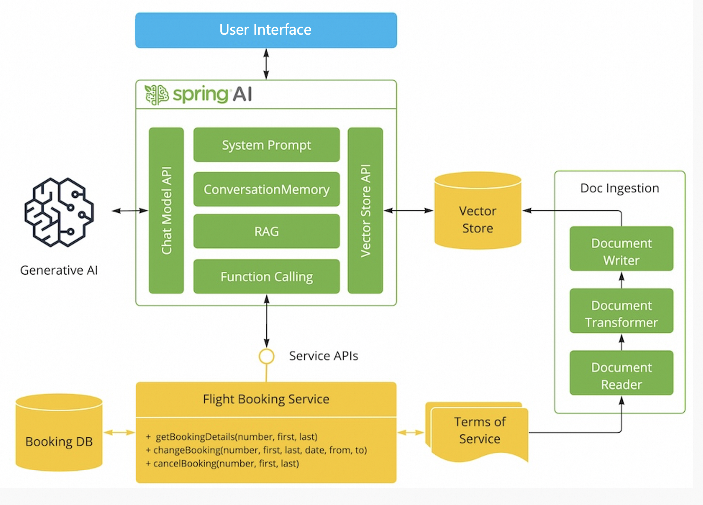

在使用 langchain 的过程中，大模型给人留下最深刻的印象无疑是 Agent 功能。大模型会自己分析问题，选择合适的工具，最终解决问题。这个功能背后的原理就是来自 ReAct 框架。
ReAct 是 Reasoning and Acting缩写，意思是 LLM 可以根据逻辑推理（Reason），构建完整系列行动（Act），从而达成期望目标。LLM 灵感来源是人类行为和推理之间的协同关系。人类根据这种协同关系学习新知识，做出决策，然后执行。LLM 模型在逻辑推理上有着非常优秀的表现，因此有理由相信 LLM 模型也可以像人类一样进行逻辑推理，学习知识，做出决策，并执行。在实际使用中，LLM 会发生幻觉和错误判断的情况。这是因为 LLM 在训练的时候接触到的知识有限。因此对超出训练过程中使用的数据进行逻辑分析时，LLM 就会开始不懂装懂地编造一些理由。因此对于解决这个问题最好的办法是，可以保证 LLM 模型在做出分析决策时，必须将应该有的知识提供给 LLM。
ReAct 方式的作用就是协调 LLM 模型和外部的信息获取，与其他功能交互。如果说 LLM 模型是大脑，那 ReAct 框架就是这个大脑的手脚和五官。同时具备帮助 LLM 模型获取信息、输出内容与执行决策的能力。对于一个指定的任务目标，ReAct 框架会自动补齐 LLM 应该具备的知识和相关信息，然后再让 LLM 模型做出决策，并执行 LLM 的决策。

 
一个 ReAct 流程里，关键是三个概念： 
* Thought：由 LLM 模型生成，是 LLM 产生行为和依据。可以根据 LLM 的思考，来衡量他要采取的行为是否合理。这是一个可用来判断本次决策是否合理的关键依据。相较于人类，thought 的存在可以让 LLM 的决策变得更加有可解释性和可信度。
* Act：Act 是指 LLM 判断本次需要执行的具体行为。Act 一般由两部分组成：行为和对象。用编程的说法就是 API 名称和对应的入参。LLM 模型最大的优势是，可以根据 Thought 的判断，选择需要使用的 API 并生成需要填入 API 的参数。从而保证了 ReAct 框架在执行层面的可行性。
* Obs：LLM 框架对于外界输入的获取。它就像 LLM 的五官，将外界的反馈信息同步给 LLM 模型，协助 LLM 模型进一步的做分析或者决策。

一个完整的 ReAct 的行为，包涵以下几个流程：
1. 输入目标：任务的起点。可以是用户的手动输入，也可以是依靠触发器（比如系统故障报警）。
2. LOOP：LLM 模型开始分析问题需要的步骤（Thought），按步骤执行 Act，根据观察到的信息（Obs），循环执行这个过程。直到判断任务目标达成。
3. Finish：任务最终执行成功，返回最终结果。


一个可以自己尝试 ReAct 过程的 Prompt 的例子：
```
You are an assistant, please fully understand the user's question, choose the appropriate tool, and help the user solve the problem step by step.

### CONSTRAINTS ####
1. The tool selected must be one of the tools in the tool list.
2. When unable to find the input for the tool, please adjust immediately and use the AskHumanHelpTool to ask the user for additional parameters.
3. When you believe that you have the final answer and can respond to the user, please use the TaskCompleteTool.
5. You must response in Chinese;

### Tool List ###

[
Search: 如果需要搜索请用它.paramDescription ： [{"name": "searchKey", "description": "搜索参数","type":"String"}]
AskHumanHelpTool: 如果需要人类帮助，请使用它。paramDescription ： [{"name": "question", "description": "问题","type":"String"}]
TaskCompleteTool：如果你认为你已经有了最终答案，请使用它。paramDescription ： [{"name": "answer", "description": "答案","type":"String"}]
]

You should only respond in JSON format as described below

### RESPONSE FORMAT ###
{
{"thought": "为什么选择这个工具的思考","tool_names": "工具名","args_list": {“工具名1”:{"参数名1": "参数值1","参数名2": "参数值2"}}}}
Make sure that the response content you return is all in JSON format and does not contain any extra content.
```


把它复制粘贴到大模型对话中，就可以感受一下最初级的 ReAct 交互的体验。我们自己充当一个 ReAct 框架，去执行 Act 和 Obs 过程。


### Spring AI 简介

尽管Python最近成为了编程语言的首选，但是Java在人工智能领域的地位同样不可撼动，得益于强大的Spring框架。随着人工智能技术的快速发展，我们正处于一个创新不断涌现的时代。从智能语音助手到复杂的自然语言处理系统，人工智能已经成为了现代生活和工作中不可或缺的一部分。在这样的背景下，Spring AI 项目迎来了发展的机遇。尽管该项目汲取了Python项目如LangChain和LlamaIndex的灵感，但Spring AI并不是简单的移植。该项目的初衷在于推进生成式人工智能应用程序的发展，使其不再局限于Python开发者。

Spring AI 的核心理念是提供高度抽象化的组件，作为开发AI应用程序的基础。这些抽象化组件具备多种实现，使得开发者能够以最少的代码改动便捷地交换和优化功能模块。

具体而言，Spring AI 提供了支持多种主流模型提供商的功能，包括OpenAI、Microsoft、Amazon、Google和Hugging Face。支持的模型类型涵盖了从聊天机器人到文本生成、图像处理、语音识别等多个领域。而其跨模型提供商的可移植API设计，不仅支持同步和流式接口，还提供了针对特定模型功能的灵活选项。


此外，Spring AI 还支持将AI模型输出映射为POJO，以及与主流矢量数据库提供商（如Apache Cassandra、Azure Vector Search、MongoDB Atlas等）无缝集成的能力。其功能不仅局限于模型本身，还包括了数据工程中的ETL框架和各种便利的函数调用，使得开发AI应用程序变得更加高效和可靠。


### Spring AI 初识

首先。我们先搭建一个项目。最低要求是jdk17
引入spring ai相关的包，然后，引入spring ai openai相关的包。

[pom.xml](..%2F..%2Fpom.xml)

日志级别设置为debug吗，方便调试。
[application.properties](..%2Fmain%2Fresources%2Fapplication.properties)


#### Spring AI model 模型对话

然后，我们来了解下以下spring ai中最基本的单元：模型。
先进行聊天模型相关配置。
[application.properties](..%2Fmain%2Fresources%2Fapplication.properties)

聊天模型配置好后，我们可以直接使用模型进行对话等操作。
[PlainAiChatDemo.java](..%2Ftest%2Fjava%2Fcom%2Fdemo%2Fspringai%2Faidemo%2Fhelloai%2FPlainAiChatDemo.java)

#### Spring AI chat client 对话

同时，spring ai提供了chatClient，封装了通用的对话操作。
[PlainAiChatClientDemo.java](..%2Ftest%2Fjava%2Fcom%2Fdemo%2Fspringai%2Faidemo%2Fhelloai%2FPlainAiChatClientDemo.java)

#### Spring AI 依赖注入
如果项目已经使用了spring，那么使用spring自身的注解就可以可以很方便的接入ai。
只需要配置application.properties

```properties
spring.ai.openai.api-key=${AI_OPENAI_KEY}
spring.ai.openai.base-url=${AI_OPENAI_BASEURL}
spring.ai.openai.chat.options.model=${AI_OPENAI_MODEL}
```
直接引入即可：
```java

private final ChatModel chatModel;
```

注意，ChatClient chatClient需要自己进行构建

```java
private final ChatClient chatClient;
public ChatModelController( ChatClient.Builder chatClientBuilder) {
    this.chatClient = chatClientBuilder.build();
}

```
示例代码：
[ChatModelController.java](..%2Fmain%2Fjava%2Fcom%2Fdemo%2Fspringai%2Faidemo%2Fcontroller%2FChatModelController.java)


### 实际场景

接下来，我们通过一个更贴近实际使用场景的示例，来展示 Spring AI 在构建智能体应用方面的强大能力。

#### 示例目标
使用 Spring AI 框架开发一个智能会议室预定助手，它可以帮助企业员工完成会议室预定、查询可用性、取消预定等动作，具体要求为：

- 基于 AI 大模型与用户对话，理解用户自然语言表达的需求。
- 支持多轮连续对话，能在上下文中理解用户意图。
- 理解会议室预定相关的术语与规范并严格遵守，如预定规则、取消政策等。
- 在必要时可调用工具辅助完成任务。

### 设计方案
接下来，我们结合架构图对示例进行详细分析。

#### 为应用接入 AI 模型服务
我们使用 Spring Boot 开发一个Java应用，此应用能够持续地接收用户的提问，为用户解决会议室预定相关的问题。之所以称其为智能体应用，是因为该应用可以与AI交互，由AI帮助应用理解用户的问题并为用户做出决策。简化后的架构图展示了AI模型如何理解用户问题，决策下一步动作，以及如何驱动业务流程。

#### 使用 RAG 增加会议室预定规则
为了确保AI模型能够正确地理解和处理会议室预定的请求，我们采用RAG模式将会议室预定的相关规则和政策输入给应用和AI模型。这样，AI就可以结合这些规则与要求辅助决策，例如检查是否有足够的权限预定特定会议室，或者确定取消预定的时间限制等。

#### 使用 Function Calling 执行业务动作
虽然AI智能体可以帮助应用理解用户需求并作出决策，但实际的预定、取消等操作仍需由应用自身完成。通过Spring AI框架，我们可以将模型的决策转换为对特定函数的调用，以实现预定或取消操作，并更新数据库中的记录。这即是我们所说的Function Calling模式。

#### 使用 Chat Memory 增加多轮对话能力
为了支持多轮连续对话，应用需要具备维护对话上下文的能力。由于大模型本身是无状态的，因此应用必须保存之前的对话历史，并在新的对话回合中将其与最新的问题一起发送给模型。Spring AI提供了内置的Conversation Memory支持，使维护对话上下文变得更加简便。


### 小结
基于这样一个智能会议室预定助手的目标，因此，我们的总体架构图，如下所示。




对于spring ai，我们需要掌握以下的知识。


### 总结
在本智能会议室预定助手应用中，我们主要运用了Spring AI的核心能力：

- 基本模型对话能力，通过Chat Model API与阿里云通义模型进行交互。
- Prompt管理能力，用于构建有效的对话提示。
- Chat Memory聊天记忆功能，支持多轮对话。
- RAG、Vector Store等技术，用于处理会议室预定、取消等相关的规则。

通过这些技术的应用，我们的智能助手不仅能够高效地处理会议室预定相关的事务，还能提供更加人性化的用户体验。

### 进阶：对话记忆


### 进阶：RAG


### 进阶：方法调用


